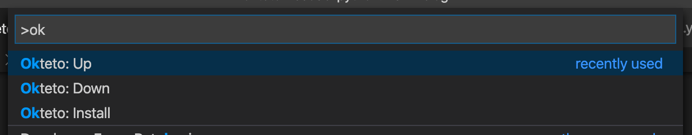
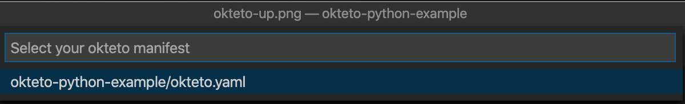
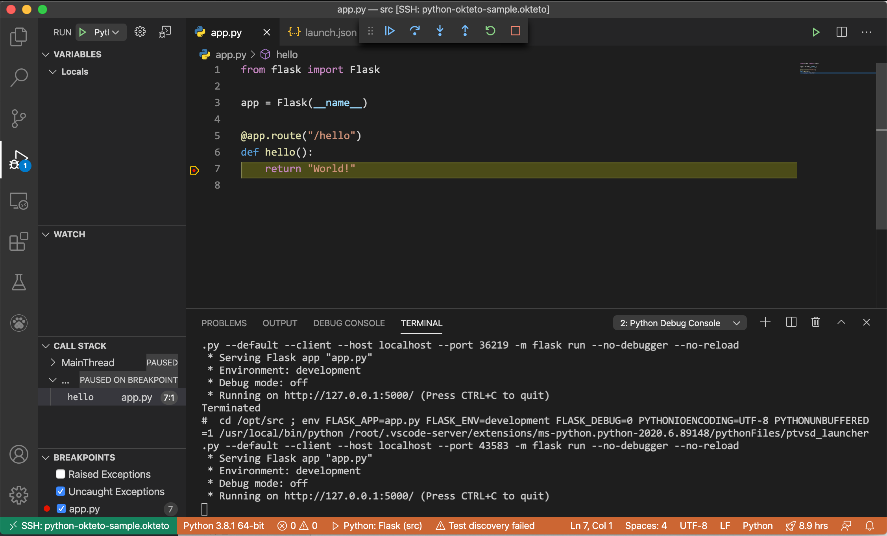

# Okteto-python-example

This example works as a small demo to show how to use `Okteto` + `VS Code's Remote - Kubernetes` extension to start a `Python` remote development environment in Kubernetes.

## Prerequisite
- VS Code 1.39 or newer.
- Install [VS Code Remote - Kubernetes](https://marketplace.visualstudio.com/items?itemName=okteto.remote-kubernetes).
- A Kubernetes cluster. If you are Mac OS X user, docker desktop's builtin Kubernetes cluster is your friend. If not, Okteto also provides a free [Okteto Cloud](https://okteto.com/) service.

## Launch the Remote Environment
- Clone this project and use VS Code to open it:
```
git clone https://github.com/lockercho/okteto-python-example
cd okteto-python-example
code .
```

- Open Command Palette (shortcut: `⇧⌘P`), search and select `Okteto: Up`, press `Enter`.



- Next, select `okteto-python-example/okteto.yaml` as okteto manifest, press `Enter`.



- It may take a while to start your remote environment. Once it's completed, a new VS Code window titled `[SSH: okteto-python-example.okteto]` will be automatically opened.


## Set up Python Environment
Now you've launched a remote environment; it's time to set up the python debugging.
- In the new VS Code window, open `EXTENSIONS`, search `python` extension and install it. Once the installation is done, click `reload required` to reload window. (Though you might have already installed the python extension in your local machine, since the VS Code is running in the new remote environment, you have to re-install it.)

- Open Command Palette again, click `Python: Select Interpreter`. Select `/usr/local/bin/python`.

- Open VS Code terminal to install the python dependencies:
```
pip install -r requirements.txt
```

## Launch Demo APP
- Use VS Code's `Run -> Start debugging` to run the flask app on port 5000.

- Finally, go back to the local machine's terminal. Because the `okteto.yaml` was configured to also forward remote port `5000` to local port `25000`, now you can use curl localhost to test it, you should see the API endpoint returns `World!`:
```
$ curl http://localhost:25000/hello
World!
```

- You may also set up a breakpoint on app.py line 7, then try to `curl` the endpoint again. You should see the breakpoint is triggered.



- Happy coding!